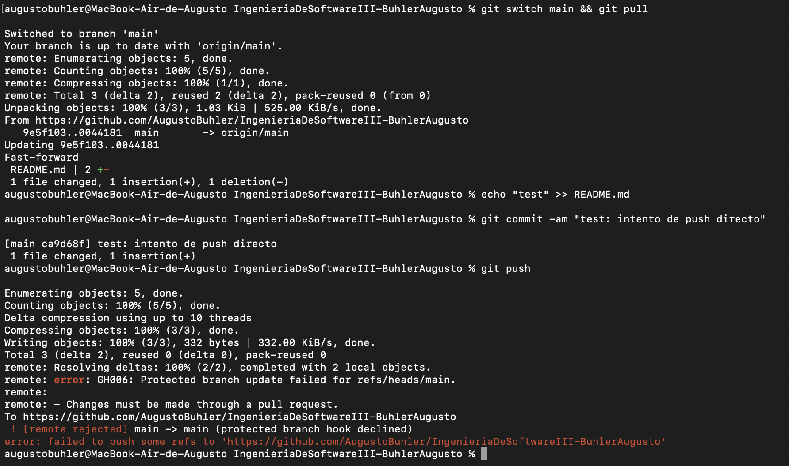
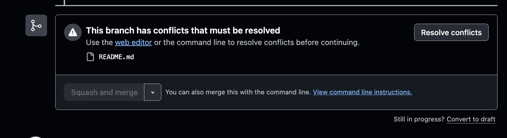
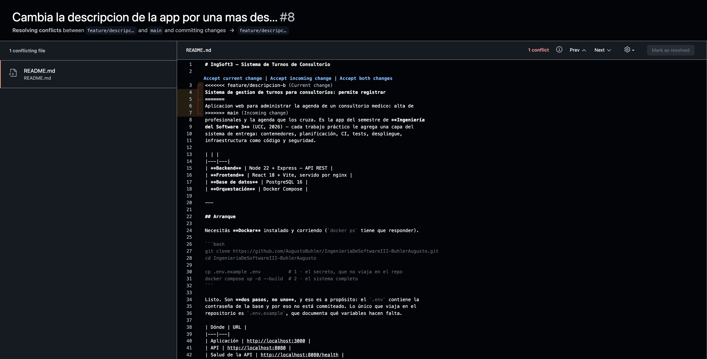
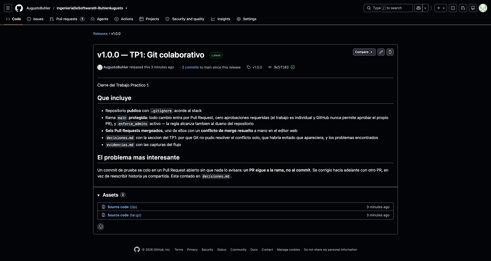
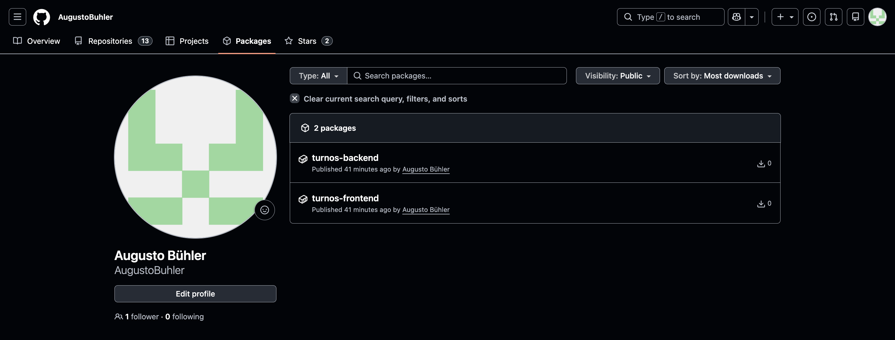

# Evidencias

---

## TP1 — Git colaborativo

### 1. Push directo a `main` rechazado



Con `main` protegida, el intento de pushear directo se rechaza **del lado del
servidor**. El commit local se creó sin problema (`[main 394fa07]`); lo que falló
fue publicarlo:

```
remote: error: GH006: Protected branch update failed for refs/heads/main.
remote:
remote: — Changes must be made through a pull request.
To https://github.com/AugustoBuhler/IngenieriaDeSoftwareIII-BuhlerAugusto
 ! [remote rejected] main -> main (protected branch hook declined)
error: failed to push some refs to 'https://github.com/AugustoBuhler/IngenieriaDeSoftwareIII-BuhlerAugusto'
```

El rechazo alcanza **también al dueño del repositorio**, porque la protección tiene
`enforce_admins` activo. Sin esa opción GitHub dejaría pasar al admin y la
protección sería decorativa.

### 2. El PR de la rama B no se puede mergear: conflicto



`feature/titulo-a` y `feature/titulo-b` salieron del mismo commit (`b4d8992`) y
modificaron la misma línea del `README.md`. Mergeado el PR #3 (rama A), el PR #4
(rama B) quedó bloqueado: GitHub no puede fusionar automáticamente.

Estado del PR consultado por API en ese momento:

```
mergeable: CONFLICTING
mergeStateStatus: DIRTY
```

### 3. Los marcadores del conflicto



El editor web de *Resolve conflicts*, con las tres fronteras que pone Git:

```
<<<<<<< feature/titulo-b
# Ingenieria del Software 3 · Turnos
=======
# IngSoft3 — Sistema de Turnos de Consultorio
>>>>>>> main
```

Arriba la versión de la rama del PR, abajo la que ya estaba en `main`. Resolver es
elegir el contenido final y borrar los marcadores — no es ejecutar un comando.

### 4. Release `v1.0.0` publicada



---

## TP2 — Contenedores

### 1. `docker compose up -d` levanta el sistema completo

```
 Container ...-db-1        Starting
 Container ...-db-1        Started
 Container ...-db-1        Waiting
 Container ...-db-1        Healthy          ← el healthcheck de PostgreSQL
 Container ...-backend-1   Starting         ← recién ahora arranca el backend
 Container ...-backend-1   Started
 Container ...-frontend-1  Starting
 Container ...-frontend-1  Started
```

La secuencia `Waiting → Healthy → backend Starting` es el `depends_on` con
`condition: service_healthy` funcionando: el backend no arranca hasta que la base
**acepta conexiones**, no solo hasta que el contenedor existe.

Estado de los tres servicios:

```
SERVICE    IMAGE                                            STATUS
backend    ingenieriadesoftwareiii-buhleraugusto-backend    Up
db         postgres:16-alpine                               Up (healthy)
frontend   ingenieriadesoftwareiii-buhleraugusto-frontend   Up
```

### 2. El sistema funcionando end-to-end

```bash
$ curl -s localhost:8080/health
{"status":"ok"}

$ curl -s -X POST localhost:8080/api/profesionales -d '{"nombre":"Dra. Lopez","especialidad":"Clinica"}'
{"id":1,"nombre":"Dra. Lopez","especialidad":"Clinica"}

$ curl -s -X POST localhost:8080/api/pacientes -d '{"nombre":"Juan Perez","dni":"30111222"}'
{"id":1,"nombre":"Juan Perez","dni":"30111222"}

$ curl -s -X POST localhost:8080/api/turnos -d '{"pacienteId":1,"profesionalId":1,"fechaHora":"2026-09-15T14:00:00Z"}'
{"id":1,"paciente_id":1,"profesional_id":1,"fecha_hora":"2026-09-15T14:00:00.000Z","estado":"PENDIENTE"}
```

El proxy de nginx, que es lo que conecta el front con el back dentro de la red de
compose:

```bash
$ curl -s -o /dev/null -w "%{http_code}" localhost:3000            # la SPA
200
$ curl -s -o /dev/null -w "%{http_code}" localhost:3000/api/turnos # proxeado al backend
200
```

Las siete reglas de negocio frenando:

```
DNI duplicado                    400  {"error":"Ya existe un paciente con el DNI 30111222"}
DNI invalido (3 digitos)         400  {"error":"El DNI debe tener 7 u 8 digitos numericos"}
Turno en fecha pasada            400  {"error":"No se puede sacar un turno en una fecha pasada"}
Turno solapado                   400  {"error":"El profesional ya tiene un turno que se superpone con ese horario"}
Borrar profe con pendiente       400  {"error":"No se puede eliminar un profesional con turnos pendientes"}
PENDIENTE -> ATENDIDO            200  {"id":1,...,"estado":"ATENDIDO"}
ATENDIDO -> CANCELADO            400  {"error":"No se puede pasar de ATENDIDO a CANCELADO"}
```

### 3. Prueba de persistencia: `down`/`up` vs `down -v`

```bash
### 1. Datos actuales
[{"id":1,"fecha_hora":"2026-09-15T14:00:00.000Z","estado":"ATENDIDO",
  "paciente":"Juan Perez","dni":"30111222","profesional":"Dra. Lopez"}]

### 2. docker compose down  (SIN -v)  +  up
[{"id":1,"fecha_hora":"2026-09-15T14:00:00.000Z","estado":"ATENDIDO",
  "paciente":"Juan Perez","dni":"30111222","profesional":"Dra. Lopez"}]
   -> los datos SOBREVIVIERON: el volumen no se toco

### 3. docker compose down -v  (CON -v)  +  up
[]
   -> vacio: -v borro el volumen y con el los datos
```

`down` apaga los contenedores y borra la red; el **volumen nombrado** `db_data`
queda. `down -v` agrega los volúmenes a esa lista, y ahí sí los datos se pierden.

### 4. Tamaño: imagen final vs etapa de build

Comparación construyendo explícitamente la etapa `build` de cada Dockerfile
(`docker build --target build`) contra la imagen final:

```
frontend - etapa de build (node + deps + dist)   370MB
frontend - imagen FINAL (nginx + estaticos)       93MB

backend  - etapa de build (con devDependencies)  300MB
backend  - imagen FINAL (solo prod deps)         235MB
```

Y las imágenes base, para dimensionar:

```
node:22-alpine    228MB      ← la que COMPILA
nginx:alpine      92.7MB     ← la base del frontend final
```

El frontend se reduce 4x porque su imagen final **no necesita Node**: nginx sirve
archivos estáticos. El backend baja menos porque sigue necesitando el runtime; lo
que se ahorra son las dependencias de desarrollo y el caché de npm.

### 5. Imágenes publicadas en el registry, públicas



```
ghcr.io/augustobuhler/turnos-backend:v0.1.0
ghcr.io/augustobuhler/turnos-frontend:v0.1.0
```

### 6. `docker-compose.registry.yml`: el sistema sin el código

Decir que un package es público es fácil; la prueba es **bajarlo sin credenciales**.
Antes de levantarlo hubo que vaciar los tres lugares donde Docker esconde las capas
—la imagen que construyó el compose, los nombres que le puse yo, y el caché de
construcción—, porque si no el `up` contesta `Already exists` y no descarga nada:

```bash
$ docker compose down --rmi local
$ docker logout ghcr.io
Removing login credentials for ghcr.io
$ docker rmi ghcr.io/augustobuhler/turnos-backend:v0.1.0 ghcr.io/augustobuhler/turnos-frontend:v0.1.0
$ docker builder prune -af
```

Y recién ahí, **sin sesión iniciada en el registry**:

```bash
$ docker compose -f docker-compose.registry.yml up -d
 frontend Pulling
 backend Pulling
 7891cfa3d49e Pulling fs layer
 21e7d9fd39b2 Pulling fs layer
 e6be5d00821a Pulling fs layer
 frontend Pulled
 backend Pulled
 Container ...-db-1        Started
 Container ...-db-1        Waiting
 Container ...-db-1        Healthy
 Container ...-backend-1   Started
 Container ...-frontend-1  Started
```

Descargó las dos imágenes estando deslogueado: eso es lo que prueba que son
públicas, no que la página diga *Public*.

**La verificación central de este práctico** — la columna `IMAGE` tiene que decir
`ghcr.io/...`. Si dijera `<carpeta>-backend`, el compose estaría construyendo en vez
de descargando, y no valdría:

```
$ docker compose -f docker-compose.registry.yml ps

SERVICE    IMAGE                                          STATUS
backend    ghcr.io/augustobuhler/turnos-backend:v0.1.0    Up 10 seconds
db         postgres:16-alpine                             Up 15 seconds (healthy)
frontend   ghcr.io/augustobuhler/turnos-frontend:v0.1.0   Up 10 seconds
```

Y el sistema funcionando desde esas imágenes descargadas:

```bash
$ curl -s localhost:8080/health
{"status":"ok"}

$ curl -s -X POST localhost:8080/api/profesionales -d '{"nombre":"Dr. Garcia","especialidad":"Pediatria"}'
{"id":1,"nombre":"Dr. Garcia","especialidad":"Pediatria"}

$ curl -s -o /dev/null -w "%{http_code}" localhost:3000            # la SPA
200
$ curl -s -o /dev/null -w "%{http_code}" localhost:3000/api/profesionales   # el proxy
200
```

---

## TP3 — Planificación y trazabilidad

En este práctico **no hace falta `evidencias.md`**: el Project es público y se ve
en vivo.

Project: https://github.com/users/AugustoBuhler/projects/1

## TP4 — CI

En este práctico **no hace falta `evidencias.md`**: el repositorio es público y las
corridas, los checks y el badge se ven solos en la pestaña *Actions* y en los PRs.
